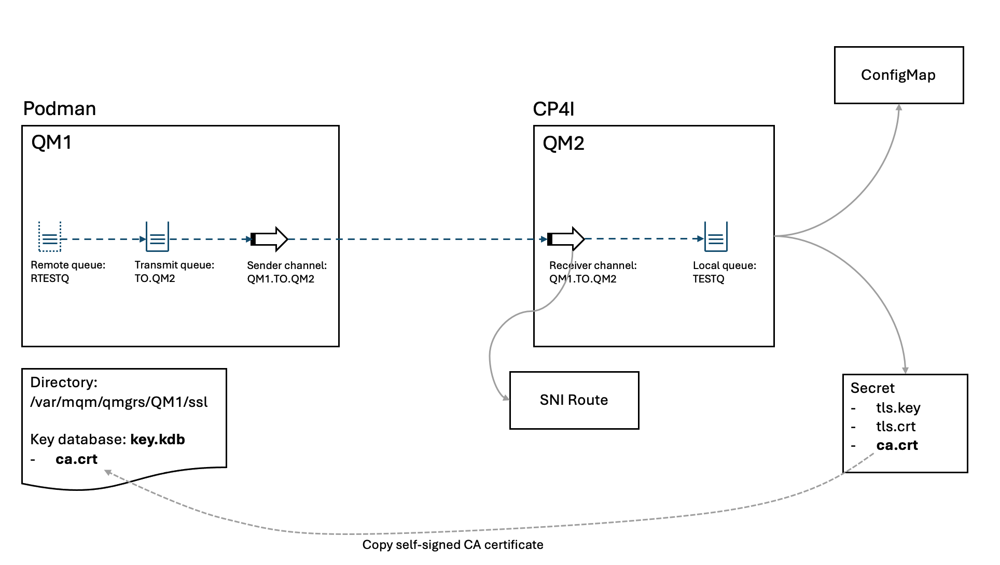

# Accessing IBM MQ queue manager running on CP4I (OpenShift)

>NOTE: This is a work in progress. It's not finished yet.

## Prepare a queue manager on OpenShift

### Prepare certificates

Create a separate directory for the certificates
```sh
mkdir workdir
cd workdir
```

If you don't have the CA certificate create a self-signed one:
```sh
openssl genpkey -algorithm rsa -pkeyopt rsa_keygen_bits:4096 -out ca.key
openssl req -x509 -new -nodes -key ca.key -sha512 -days 365 -subj "/CN=example-selfsigned-ca" -out ca.crt
```

Create key and certificate signing request for queue manager:
```sh
openssl req -new -nodes -out queuemanager.csr -newkey rsa:4096 -keyout queuemanager.key -subj '/CN=queuemanager'
```

Create queue manager certificate signed with CA:
```sh
openssl x509 -req -in queuemanager.csr -CA ca.crt -CAkey ca.key -CAcreateserial -out queuemanager.crt -days 365 -sha512
```

### Create secret with queue manager certificates

So far, we have:
- ca.crt
- queuemanager.crt
- queuemanager.key

Create secret in the OpenShift namespace where the queue manager instance will be created:
```sh
oc create secret generic queuemanager --type="kubernetes.io/tls" --from-file=tls.key=queuemanager.key --from-file=tls.crt=queuemanager.crt --from-file=ca.crt
```

### Prepare queue manager configuration

This is an example of the ConfigMap with the MQ minimal configuration. In the following examples, we will create variations of it with different configurations.

Create the ConfigMap in the same namespace where the queue manager instance will be running.

```yaml
apiVersion: v1
kind: ConfigMap
metadata:
  name: queuemanager-configmap
data:
  queuemanager.mqsc: |
    ALTER AUTHINFO(SYSTEM.DEFAULT.AUTHINFO.IDPWOS)  AUTHTYPE(IDPWOS) CHCKCLNT(NONE) CHCKLOCL(NONE)
    REFRESH SECURITY TYPE(CONNAUTH)

    * More MQSC commands...

  queuemanager.ini: |
    Service:
        Name=AuthorizationService
        EntryPoints=14
        SecurityPolicy=UserExternal
```

### Create queue manager

Note how the previously created ConfigMap and TLS secret are referenced. 

Please note also that the namespace is *qmtest* - change it to your namespace. Please accept license before applying YAML by changing *spec.license.accept* from *false* to *true*.

```yaml
apiVersion: mq.ibm.com/v1beta1
kind: QueueManager
metadata:
  name: qm2
  namespace: qmtest
spec:
  license:
    accept: false
    license: L-CYPF-CRPF3H
    use: NonProduction
  queueManager:
    name: QM2
    resources:
      limits:
        cpu: 500m
      requests:
        cpu: 500m
    mqsc:
    - configMap:
        name: queuemanager-configmap
        items:
        - queuemanager.mqsc
    ini:
    - configMap:
        name: queuemanager-configmap
        items:
        - queuemanager.ini
    storage:
      queueManager:
        type: ephemeral
    # availability:
    #   type: NativeHA
  version:  9.4.3.0-r2
  web:
    console:
      authentication:
        provider: integration-keycloak
      authorization:
        provider: integration-keycloak
    enabled: true
  pki:
    keys:
      - name: default
        secret:
          secretName: queuemanager
          items:
            - tls.key
            - tls.crt
            - ca.crt
```

## EXAMPLE 1: Testing QM to QM connection using Podman

We will run an instance of queue manager locally in the Podman container and create a channel to the queue manager running on OpenShift. 

The following picture shows the test configuration:



### Create a receiver channel and local queue on the queue manager on OpenShift

Update the ConfigMap by adding the following MQSC commands (watch out YAML indentations)

```sh
DEFINE CHANNEL(QM1.TO.QM2) CHLTYPE(RCVR) SSLCIPH(ANY_TLS12_OR_HIGHER) SSLCAUTH(OPTIONAL)
DEFINE QLOCAL(TESTQ) REPLACE
```

**Restart (delete) mq pod** to apply change in the ConfigMap. If the queue manager instance is called *qm2* and if it is a single instance the pod name is *qm2-ibm-mq-0*.

### Create SNI route for the receiver channel QM1.TO.QM2

The route points to the same service as the main route. Its host name represents channel's SNI.
Please see the following document for the explanation: https://www.ibm.com/docs/en/ibm-mq/9.4.x?topic=dcqmumo-configuring-route-connect-queue-manager-from-outside-red-hat-openshift-cluster

The route name can be anything. The **hostname** is built form the **channel name** using the following formula:
- Change all capital letters to small letters
- Leave numbers unchanged
- Change all other characters (including small letters if they initially exist in the channel name) to hexadecimal representation followed by "-" 
- Add *.chl.mq.ibm.com* as the hostname domain

In our case the channel name is: <br>
**QM1.TO.QM2**<br>
The hexadecimal representation of **dot** character is **2e**<br>
Therefore the hostname should be:<br>
**qm12e-to2e-qm2.chl.mq.ibm.com**

```yaml
apiVersion: route.openshift.io/v1
kind: Route
metadata:
  name: qm1-to-qm2-rcvr-channel
spec:
  host: qm12e-to2e-qm2.chl.mq.ibm.com
  to:
    kind: Service
    name: qm2-ibm-mq
  port:
    targetPort: 1414
  tls:
    termination: passthrough
```

### Pull MQ image on the local machine

>Note 1: We are using *podman* here. The same commands can be executed using *docker* CLI. 

>Note 2: If you are using Windows or Mac, you may need to start the podman machine first: `podman machine start` See podman's documentation for the details.

Pull the image from IBM's public registry:
```sh
podman pull icr.io/ibm-messaging/mq:latest
```

### Create volume

It will be mounted to the container and will be used for MQ peristent data
```sh
podman volume create qm1data
```


